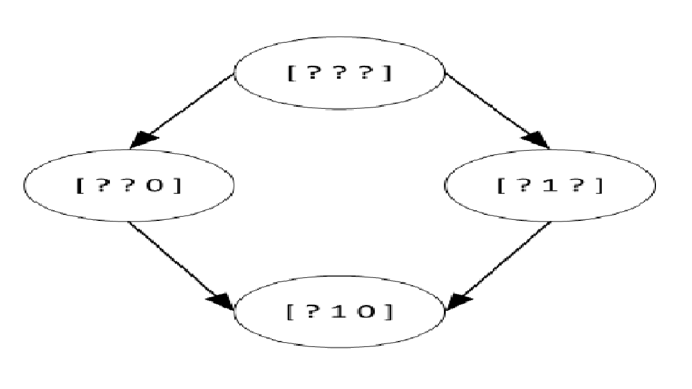

## 6. Genereller-Als-Relation, Verband von Hypothesen und Konsistenz:
Gegeben seien folgende Trainingsbeispiele eines binären Lernproblems, bei dem jedes Beispiel durch 3 boolsche Attribute a1, a2 und a3 angegeben wird. Eine Hypothese wird ebenfalls als Tripel dargestellt, wobei zusätzlich das Zeichen ’?’ bei einem Attribut für einen beliebigen Wert steht.

<table>
<tr><td>a1</td><td>a2</td><td>a3</td><td></td><td>Zielkonzept</td></tr>
<tr><td>0</td><td>1</td><td>0</td><td></td><td>1</td></tr>
<tr><td>1</td><td>0</td><td>0</td><td></td><td>0</td></tr>
<tr><td>1</td><td>1</td><td>0</td><td></td><td>1</td></tr>
<tr><td>1</td><td>0</td><td>1</td><td></td><td>0</td></tr>
</table>

1. Stellen Sie den Verband aller Hypothesen, der durch die Genereller-Als-Relation gebildet wird, graphisch dar.

2. Welche der folgenden Hypothesen sind mit den Trainingsdaten konsistent?

<table>
<tr><td>[? ? ?]</td></tr>
<tr><td>[ ]</td></tr>
<tr><td>[0 1 0]</td></tr>
<tr><td>[1 1 1]</td></tr>
<tr><td><b><u>[? 1 0]<u></b></td></tr>
<tr><td>[1 ? 0]</td></tr>
<tr><td>[? ? 0]</td></tr>
<tr><td><b><u>[? 1 ?]</u></b></td></tr>
</table>