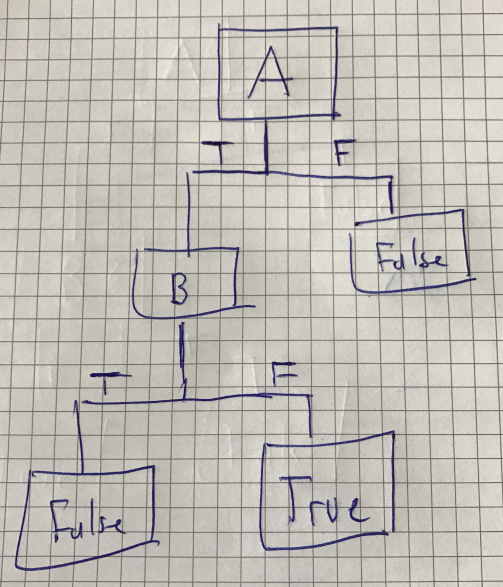
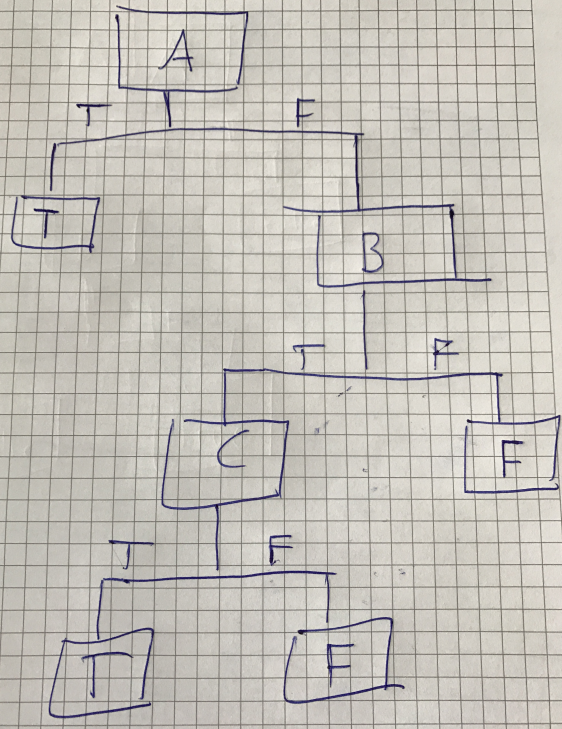
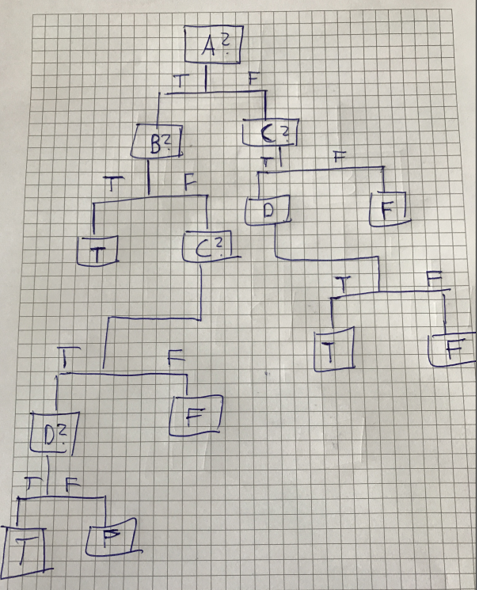

## 10. Entscheidungsbäume für boolsche Funktionen:
Geben Sie für jede der drei folgenden boolschen Funktionen einen entsprechenden Entscheidungsbaum an:

* A ∧ ¬B

* A ∨ (B ∧ C)

* (A ∧ B) ∨ (C ∧ D)

